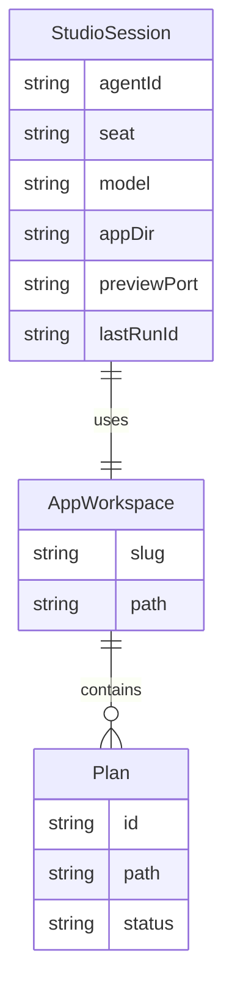

# ERD

Studio itself stores session metadata on disk, not in Postgres. Generated apps own their data.

```mermaid
erDiagram
  StudioSession {
    string agentId
    string seat
    string model
    string appDir
    string previewPort
    string lastRunId
  }

  AppWorkspace {
    string slug
    string path
  }

  Plan {
    string id
    string path
    string status
  }

  StudioSession ||--|| AppWorkspace : uses
  AppWorkspace ||--o{ Plan : contains
```

Generated request-tracker tables are documented in `templates/web-app/docs/erd.md`.
